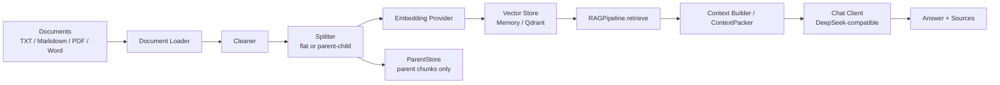
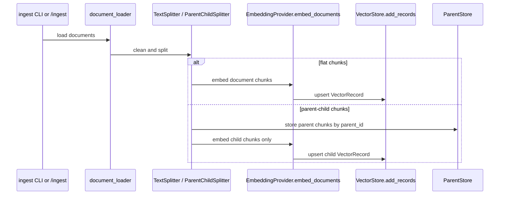
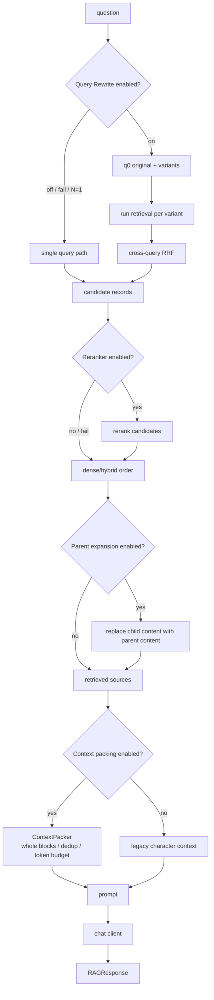
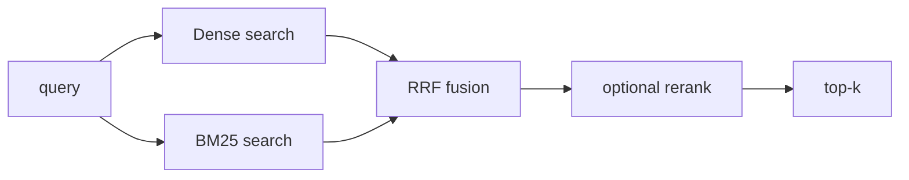
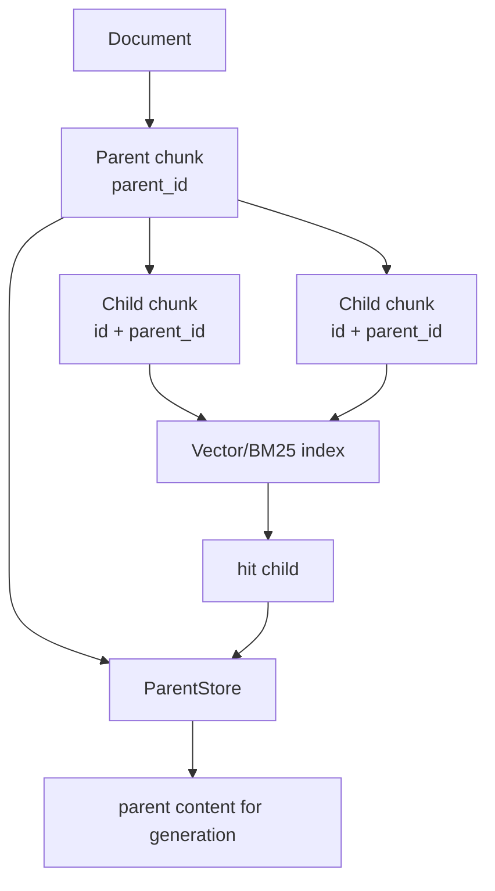
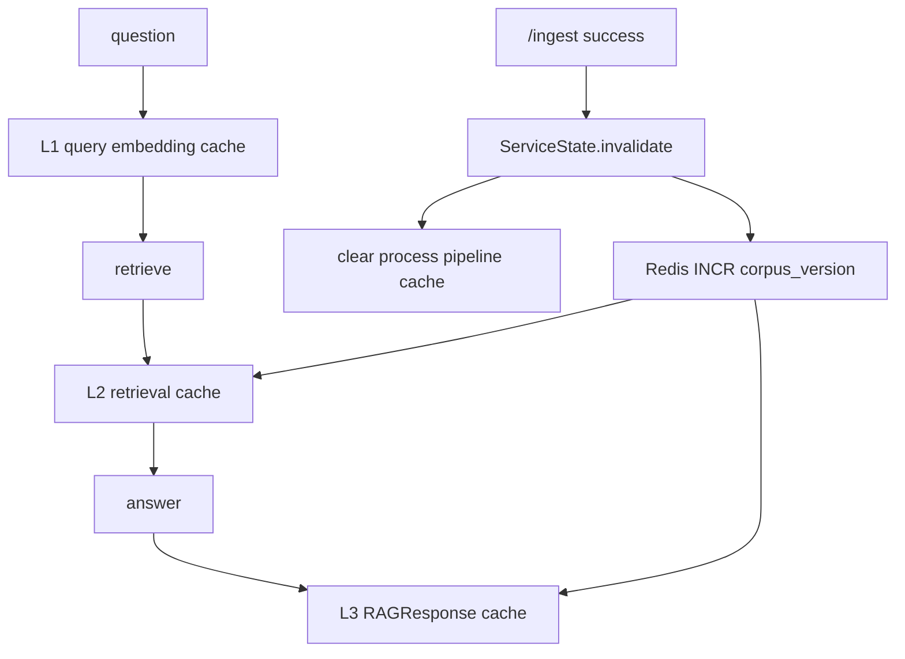
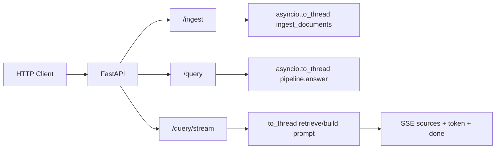
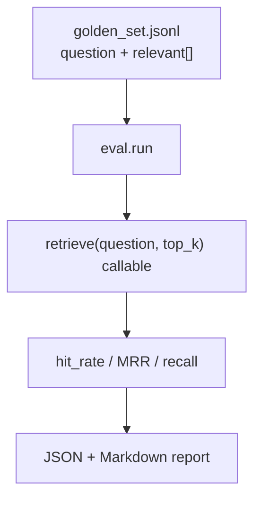

# 系统架构与数据流图

本文记录企业级 RAG 知识库当前架构。重点是模块边界、数据流、缓存位置和不能跨越的红线。

## 总览

核心原则：

- 文档入库和查询职责分离。
- 检索单元与生成单元可以不同。
- 检索评估只看 ranked list，不能被 parent expansion 或 context packing 污染。
- 缓存层包在漏斗外，不改 `rag/pipeline.py` 核心排序逻辑。

## 入库链路

入库阶段负责：

- 加载文档。
- 清洗文本。
- 切分 chunk。
- 批量 embedding。
- 写入向量库。
- 写入父块库。

入库阶段不负责：

- 回答问题。
- query rewrite。
- rerank。
- context packing。

## 查询链路

关键边界：

- Multi-query 位于 retrieve 顶端，属于检索侧，指标可以变化。
- Parent expansion 位于 top-k 之后，只替换生成内容，不应被当作检索提升。
- Context packing 只在 prompt/answer 路径，不进入 `retrieve()`。
- Cache 是外层装饰器，不重写检索漏斗。

## 检索漏斗

三条质量门禁：

- Dense baseline：`HashEmbeddingProvider` 可逐位复现。
- Rerank baseline：`DeterministicReranker` 离线、零网络。
- Hybrid baseline：reranker 关闭时并报 dense-only、bm25-only、fused。

最容易出错的是 id 对齐：

- dense 输出使用 `VectorRecord.id`。
- BM25 输出也必须使用同一 `VectorRecord.id`。
- RRF 按 id 合并 rank，不理解两个不同 id 是否文本相同。

## Parent-Child 数据模型

红线：

- 父块永不 embedding。
- 父块不进向量库、不进 BM25。
- 子块 id 仍由 `build_record_id` 生成。
- 展开发生在 top-k 之后。
- sibling collapse 只影响生成 sources，不用于宣称检索指标提升。

## Redis 缓存结构

缓存 key 规则：

- L1 = model + dimension + normalize + normalized question。
- L1 不含 `corpus_version`，因为文本向量与语料无关。
- L2 = corpus version + retrieval config + top_k + metadata_filter + normalized question。
- L3 = L2 + system prompt + chat/generation/context factors。

缓存行为：

- 命中必须短路上游调用。
- Redis 出错 fail-open 为 miss。
- 向量用二进制 float64 序列化。
- `redis.asyncio` 客户端绑定在 store 自有后台事件循环上，避免同步桥或服务线程池跨已关闭 loop 复用连接。
- live 验证必须覆盖同步 CLI/eval 形态和服务 threadpool 形态，不能只跑单个 async test loop。
- `/query/stream` 的 L3 命中是 replay，不是 live token generation。

## 服务层架构

服务层只做薄适配：

- Pydantic model。
- async endpoint。
- threadpool offload。
- SSE streaming。
- exception mapping。
- cache invalidation。

服务层不做：

- 第二套检索管线。
- 权限控制。
- 后台任务队列。
- 指标系统。

这些分别留给访问控制、后台任务队列和可观测性能力。

## 评估架构

评估器只吃 `retrieve(question, top_k)` 可调用对象，不吃完整 pipeline。这样 rerank、hybrid retrieval、parent expansion、context packing 和 multi-query retrieval 可以复用同一把尺子。

评估口径：

- Rerank：看 MRR@3 和 long-tail MRR。
- Hybrid retrieval：关闭 reranker，比 dense-only、bm25-only、fused。
- Parent-child retrieval：默认不展开父块，只评子块 ranked list。
- Context packing：不应改变 retrieval metrics。
- Multi-query retrieval：属于检索侧，可以合法改变 hit/MRR/recall，但必须分 capability 看。

## 当前部署态

- 本地开发：CLI + unittest + memory store。
- 持久化验证：Qdrant `localhost:6333`。
- 缓存验证：Redis `localhost:6379`，通过 `REDIS_URL=redis://localhost:6379/0` gated live smoke、跨事件循环回归和 fail-open 探针。
- 权限预过滤：MySQL metadata resolver 可解析 principal membership，也可在入库时按 document/chunk binding 写入 payload ACL；服务默认只信任上游 header principal，并将其显式传入 ACL filter resolver，内部不回读请求体身份。
- 服务化：FastAPI app factory，可接 uvicorn。

## 后续演进

1. 结构化审计和 Prometheus 风格指标。
2. Ragas 四维质量评估。
3. 入库增强：OCR、表格抽取优化、权限字段 fixture。
4. 权限同步增强：MySQL binding 变更后的 re-ingest/re-sync 与 gateway header 信任边界部署检查。
