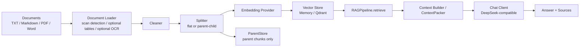
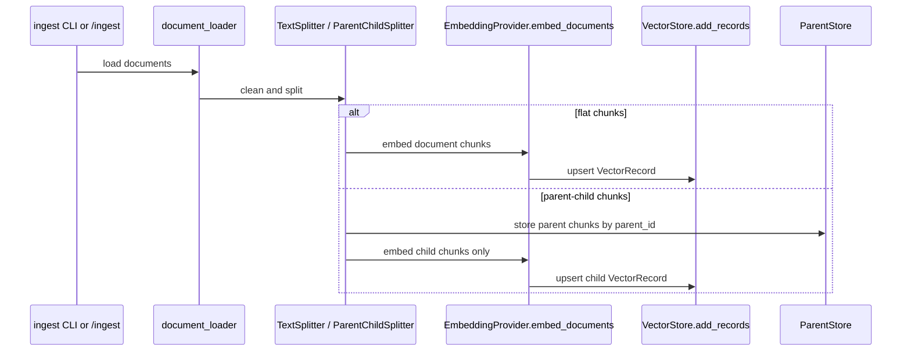
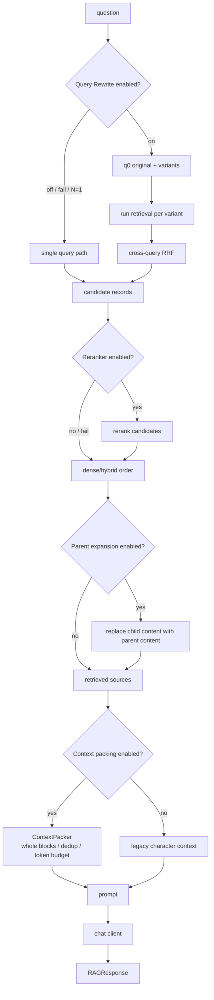
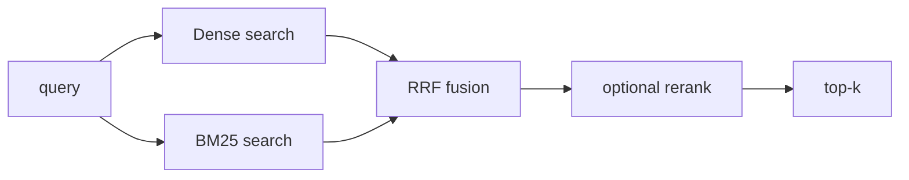
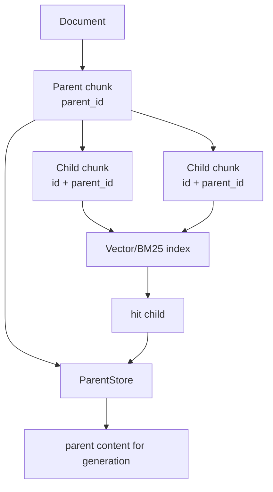
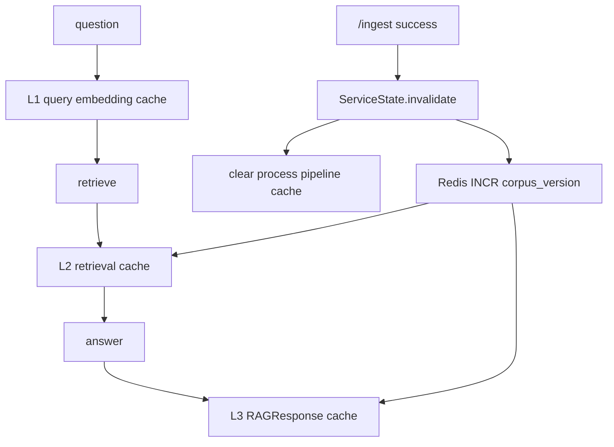
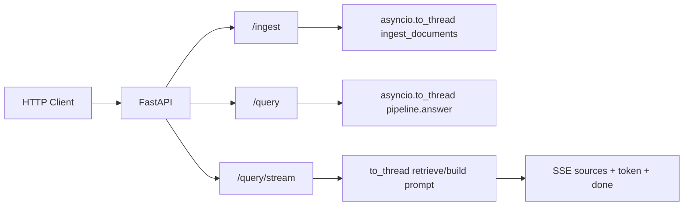
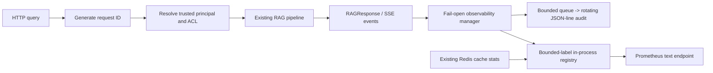
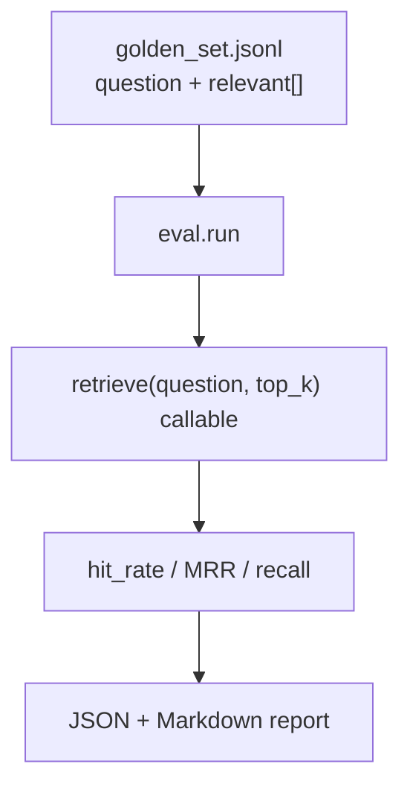
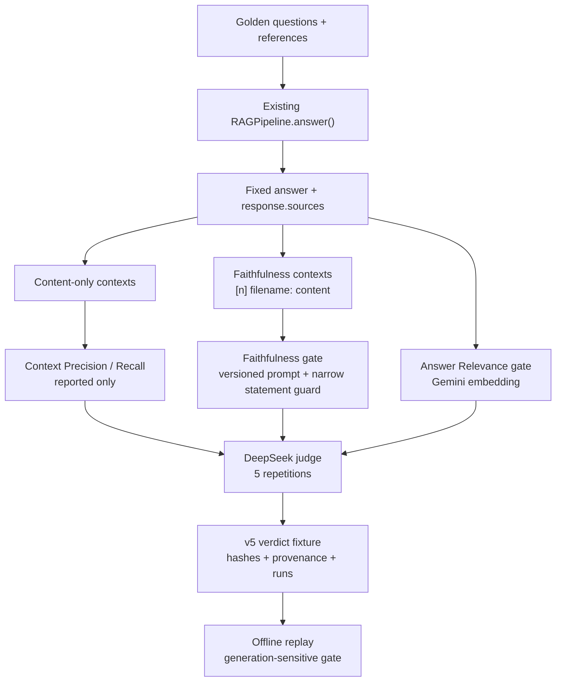

# 系统架构与数据流图

本文记录企业级 RAG 知识库当前架构。重点是模块边界、数据流、缓存位置和不能跨越的红线。

## 总览

核心原则：

- 文档入库和查询职责分离。
- 检索单元与生成单元可以不同。
- 检索评估只看 ranked list，不能被 parent expansion 或 context packing 污染。
- 缓存层包在漏斗外，不改 `rag/pipeline.py` 核心排序逻辑。

## 入库链路

入库阶段负责：

- 加载文档。
- 检测 PDF 扫描页并写入 scanned/OCR 计数 metadata。
- 在显式开启时对扫描页做逐页 OCR 兜底。
- 在显式开启时抽取 PDF 表格，并复用同一次 pdfplumber 文档句柄。
- 清洗文本。
- 切分 chunk。
- 批量 embedding。
- 写入向量库。
- 写入父块库。

入库阶段不负责：

- 回答问题。
- query rewrite。
- rerank。
- context packing。

## 查询链路

关键边界：

- Multi-query 位于 retrieve 顶端，属于检索侧，指标可以变化。
- Parent expansion 位于 top-k 之后，只替换生成内容，不应被当作检索提升。
- Context packing 只在 prompt/answer 路径，不进入 `retrieve()`。
- Cache 是外层装饰器，不重写检索漏斗。

## 检索漏斗

三条质量门禁：

- Dense baseline：`HashEmbeddingProvider` 可逐位复现。
- Rerank baseline：`DeterministicReranker` 离线、零网络。
- Hybrid baseline：reranker 关闭时并报 dense-only、bm25-only、fused。

最容易出错的是 id 对齐：

- dense 输出使用 `VectorRecord.id`。
- BM25 输出也必须使用同一 `VectorRecord.id`。
- RRF 按 id 合并 rank，不理解两个不同 id 是否文本相同。

## Parent-Child 数据模型

红线：

- 父块永不 embedding。
- 父块不进向量库、不进 BM25。
- 子块 id 仍由 `build_record_id` 生成。
- 展开发生在 top-k 之后。
- sibling collapse 只影响生成 sources，不用于宣称检索指标提升。

## Redis 缓存结构

缓存 key 规则：

- L1 = model + dimension + normalize + normalized question。
- L1 不含 `corpus_version`，因为文本向量与语料无关。
- L2 = corpus version + retrieval config + top_k + metadata_filter + normalized question。
- L3 = L2 + system prompt + chat/generation/context factors。

缓存行为：

- 命中必须短路上游调用。
- Redis 出错 fail-open 为 miss。
- 向量用二进制 float64 序列化。
- `redis.asyncio` 客户端绑定在 store 自有后台事件循环上，避免同步桥或服务线程池跨已关闭 loop 复用连接。
- live 验证必须覆盖同步 CLI/eval 形态和服务 threadpool 形态，不能只跑单个 async test loop。
- `/query/stream` 的 L3 命中是 replay，不是 live token generation。

## 服务层架构

服务层只做薄适配：

- Pydantic model。
- async endpoint。
- threadpool offload。
- SSE streaming。
- exception mapping。
- cache invalidation。
- 受信 principal 到 ACL filter 的服务端注入。
- query 完成后的审计与指标旁路。

服务层不做：

- 第二套检索管线。
- JWT/session 认证。
- 后台任务队列。

认证仍由受信网关承担，后台任务队列属于后续部署能力。

## 审计与指标数据流

观测层只读取已有返回对象、provider 累计 usage 和 cache stats，不参与召回、排序、权限判断或生成。纯 ASGI middleware 生成 request ID，通过 ContextVar 进入现有 logger 并随 `asyncio.to_thread` 传播，同时回写响应头。审计和指标运行时失败均 fail-open；只有启用后的配置错误会在应用创建时早失败。审计中的 principal/query 默认使用带部署密钥的 HMAC，source 只落稳定 record ID。指标 label 固定为有限枚举，无 request ID、principal、query 或 source ID。

## 评估架构

评估器只吃 `retrieve(question, top_k)` 可调用对象，不吃完整 pipeline。这样 rerank、hybrid retrieval、parent expansion、context packing 和 multi-query retrieval 可以复用同一把尺子。

评估口径：

- Rerank：看 MRR@3 和 long-tail MRR。
- Hybrid retrieval：关闭 reranker，比 dense-only、bm25-only、fused。
- Parent-child retrieval：默认不展开父块，只评子块 ranked list。
- Context packing：不应改变 retrieval metrics。
- Multi-query retrieval：属于检索侧，可以合法改变 hit/MRR/recall，但必须分 capability 看。

## 当前部署态

- 本地开发：CLI + unittest + memory store。
- 持久化验证：Qdrant `localhost:6333`。
- 缓存验证：Redis `localhost:6379`，通过 `REDIS_URL=redis://localhost:6379/0` gated live smoke、跨事件循环回归和 fail-open 探针。
- 权限预过滤：MySQL metadata resolver 可解析 principal membership，也可在入库时按 document/chunk binding 写入 payload ACL；服务默认只信任上游 header principal，并将其显式传入 ACL filter resolver，内部不回读请求体身份。
- 可观测性：可选 JSON-line 审计、`X-Request-ID`、Prometheus 文本指标和 fail-open 告警钩子；默认关闭。
- 文档入库：PDF 默认检测扫描页并记录 metadata；OCR 和表格抽取均默认关闭，由环境配置启用。TXT 加载器会拒绝明显二进制内容，避免 latin-1 把垃圾字节伪装成文本。
- 服务化：FastAPI app factory，可接 uvicorn。
- 一键起全栈：多阶段构建的 serving 镜像 + compose 编排四件套（向量库、缓存、元数据库、应用），后端之间用服务名互联而非 localhost，各自带原生 healthcheck，应用用 `depends_on: service_healthy` 等后端就绪再起。应用容器启动时跑一次幂等初始化（建权限 schema、seed 演示 principal/binding、按受信 ACL 入库演示语料），重复起栈不叠库。运行期资源（分词编码表）在构建期固化、可断网起容器；密钥只从环境注入、不进镜像与编排文件。默认无密钥也能起栈跑入库与检索（用不需要密钥的测试 embedding），真实问答仍需生成密钥。
- 健康门禁：存活探针 `/health` 恒 200、只表示进程存活；就绪探针 `/ready` 按配置探启用的后端，任一必需后端不通即返回 503 并点名，探针并发、有超时上界、只读探向量库、不泄敏感信息。结构性配置在应用创建时 fail-fast，缺生成密钥降级为就绪里的非阻断依赖而非拒绝启动。容器编排的健康检查打存活探针，避免后端抖动误重启进程；就绪语义留给编排层做流量准入（如 k8s readinessProbe）。

## 后续演进

1. 入库运维增强：RapidOCR 真引擎质量、模型资产打包和隔离网运行策略的 gated 复核。
2. 权限同步增强：MySQL binding 变更后的 re-ingest/re-sync 与 gateway header 信任边界部署检查。
3. 外部告警路由、多副本指标聚合，以及面向高可用的编排增强（就绪探针已就位，可直接接入编排层的流量准入）。

## 双轨生成质量评估

生成质量评估位于检索评估旁路，不进入线上请求漏斗，也不写入确定性检索报告。

live 轨先通过既有 `RAGPipeline.answer()` 生成一次答案，再固定 answer/context 重复判官五次。Faithfulness 与 Answer Relevance 按 case 使用 median 过阈值，MAD 衡量中心估计附近的稳健离散度；negative 样本单独 gate abstention/fabrication。Context Precision/Recall 的 median、MAD、mean/stddev/min/max 仍完整输出，但不产生 gate failure。

Answer Relevance 的 Gemini vectors 在 Ragas adapter 边界统一做 L2 归一化。live 判官原始分进入 fixture 前经过紧容差数值守卫：只将 `[-1e-6, 0)` 和 `(1, 1+1e-6]` clamp 回边界；NaN、inf 和更大越界立即失败。该容差只属于 capture，fixture 中的值必须已经严格位于 `[0,1]`，offline replay 的校验不放宽。

Faithfulness 与另外两类 context 指标使用不同输入：Faithfulness 需要验证答案中的来源声明，因此按 `RetrievedSource.index` 构造 `[n] filename: content`；Context Precision/Recall 继续使用 content-only。文件名从 metadata path 取 basename，绝对路径不外发。Answer Relevance 不消费 retrieved contexts，只使用问题、答案和 Gemini embedding。

Faithfulness 的 statement extraction 是概率步骤，而后续 NLI 只接收 context 与 statement，不接收原始 question。版本化 prompt 负责保留联合要求和不可缺失的理由；窄确定性 guard 只处理单句 `is relevant because`，防止关系 claim 与证明它的具体事实被拆开。该 guard 只修正 statement 边界，不修改 NLI verdict，未被 context 支持的完整 claim 仍应判 0。

Context Precision/Recall 不消费 generated answer，当前量到的是冻结 hash 检索 profile，而不是生成质量。检索列表变化由 `contexts_sha256` 与 `faithfulness_contexts_sha256` 确定性暴露，因此无需再用噪声判官阈值重复把守。reported-only 是门禁作用域收敛，不是删分或降低阈值。

replay 轨不导入 Ragas runtime、不联网，fixture 只保存 hash、分数和 provenance。当前 schema 为 `ragas-verdicts-v5`，会拒绝 stale golden、qid 集不完整、synthetic recording，以及 judge model、Ragas 版本、重复次数、生成 prompt、statement prompt、Faithfulness context format 或 gating scope 漂移。

live 数据出境包括正样本 question、generated answer、检索正文、来源文件名和 ground truth；Answer Relevance 还会向 embedding endpoint 发送文本。该路径默认关闭，ACL 敏感生产语料未经审批不得运行。当前装置已通过离线测试，但首份正式 fixture 仍需 gated 付费复测后才能冻结。
